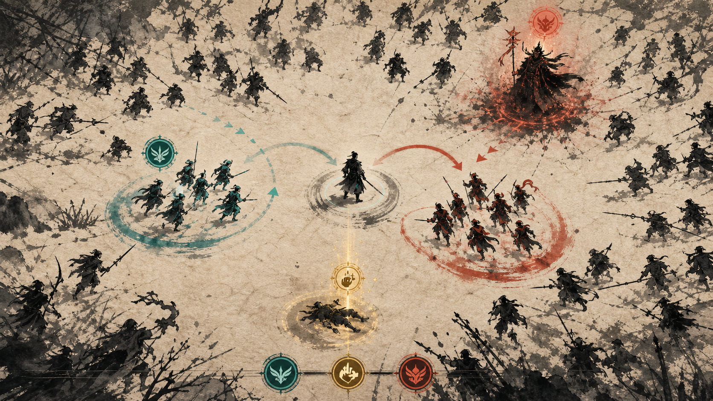

# 아트 A — 먹빛 전쟁 연대기

## 방향

오래된 전쟁 두루마리가 실시간으로 살아 움직이는 것처럼 표현한다. 한지 질감 위에 먹으로 그린 병사와 지형을 두고, 두 아군 분대만 청록과 주홍으로 구분한다.

## 시각 언어

- 배경: 따뜻한 상아색 한지, 먹 번짐, 붓으로 그린 산맥과 장애물
- 캐릭터: 검은 붓 실루엣, 병과는 무기와 자세로 구분
- 분대: 청록과 주홍의 제한된 채색
- 구조: 금색 도장형 신호와 수직 빛줄기
- 공격: 붓질, 먹물 비산, 종이가 찢기는 충격파
- UI: 글자 없는 도장형 명령 아이콘과 전술 지도 선

## 장단점

- 독창성과 발표 효과가 매우 높고 대규모 캐릭터를 단순한 형태로 처리할 수 있다.
- 먹 번짐과 배경 질감이 과하면 피격 판독이 떨어질 수 있어 전투 영역의 대비를 통제해야 한다.
- 전통 요소는 장식으로 남발하지 않고 현대적 전술 표시와 결합한다.

## 제작 범위

- 종이 배경과 지형 브러시 1세트
- 지휘관 2종, 아군 병과 6종, 적 6종, 정예 3종, 보스 1종
- 먹 공격 효과 8종, 구조·사기·피로 효과 각 1~2종

제작 난이도: 중간 · 독창성: 매우 높음 · 가독성: 높음

