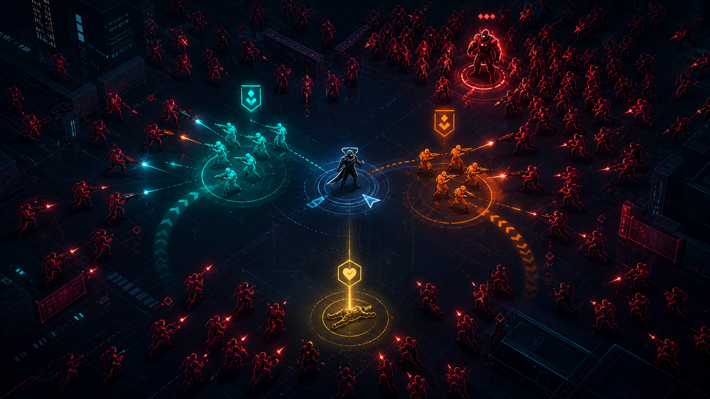

# 아트 B — 네온 전술 홀로그램

## 방향

붕괴 직전 도시를 방어하는 홀로그램 전술 화면으로 표현한다. 어두운 지도 위에 모든 전투 상태를 선, 윤곽과 제한된 발광색으로 전달한다.

## 시각 언어

- 배경: 짙은 남색 도시 격자와 얇은 등고선
- 캐릭터: 단순한 기하학 실루엣과 발광 테두리
- 분대: 시안과 주황
- 적군: 어두운 몸체와 적색 윤곽
- 구조: 금색 심박형 표식
- 피로: 발광 감소와 짧은 잔상
- 사기 붕괴: 적 연결선과 윤곽이 순차적으로 끊어짐

## 장단점

- 수백 개 캐릭터와 위험 요소의 가독성이 가장 높다.
- 작은 에셋 수와 셰이더·파티클만으로 완성도 높은 화면을 만들 수 있다.
- 일반적인 사이버펑크 화면으로 보이지 않도록 고유한 전술 기호와 세계관 재료가 필요하다.

## 제작 범위

- 도시 전술 격자 1세트
- 공통 실루엣 베이스와 병과별 무기·윤곽 변형
- 레이더, 경로, 피로, 구조, 사기 효과

제작 난이도: 낮음 · 독창성: 중간 · 가독성: 매우 높음

