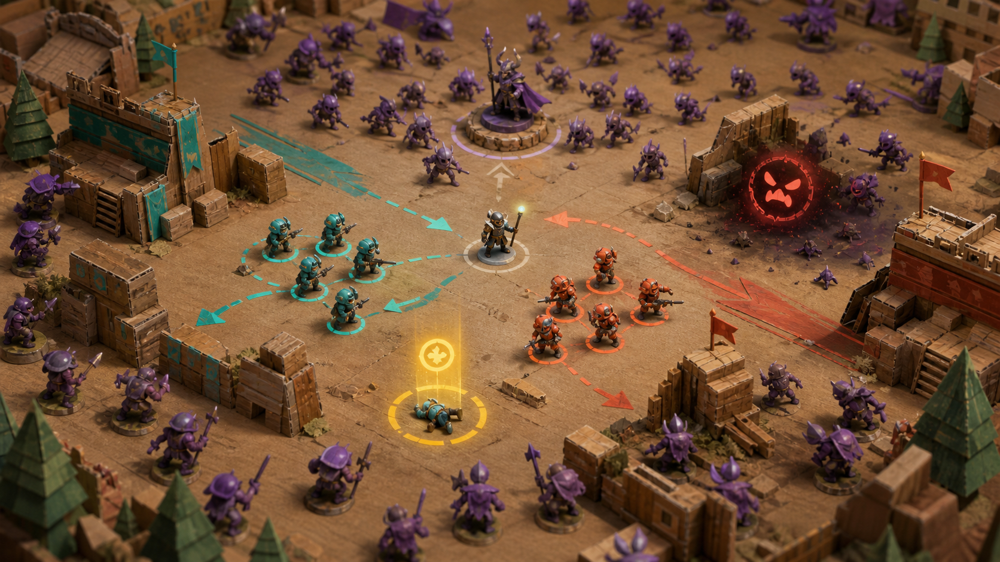

# 아트 C — 장난감 전쟁 디오라마

## 방향

책상 위 골판지 요새와 손으로 칠한 미니어처가 벌이는 생존 전쟁이다. 폭력성을 낮추면서 병사를 다시 세우는 구조 행동을 직관적으로 보여준다.

## 시각 언어

- 배경: 골판지 성벽, 나무 블록, 종이 지형과 작은 장식물
- 캐릭터: 손으로 칠한 장난감 미니어처
- 적군: 자주색 태엽 병사와 부서진 장난감
- 공격: 종이 조각, 솜구름 폭발, 크레용 궤적
- 구조: 쓰러진 미니어처를 다시 세우는 금색 토큰
- UI: 스티커와 메모지 형태의 아이콘

## 장단점

- 친근하고 한 장의 스크린샷만으로도 콘셉트가 이해된다.
- 병사 구조와 생존자 기록을 감정적으로 전달하기 좋다.
- 2D에서 입체 미니어처의 일관성을 유지하려면 렌더 또는 정교한 페인팅 파이프라인이 필요하다.

## 제작 범위

- 골판지 지형 모듈과 소품 12~16종
- 미니어처 베이스 몸체와 병과별 장비
- 종이·솜·플라스틱 재질 효과

제작 난이도: 중상 · 독창성: 높음 · 가독성: 높음

