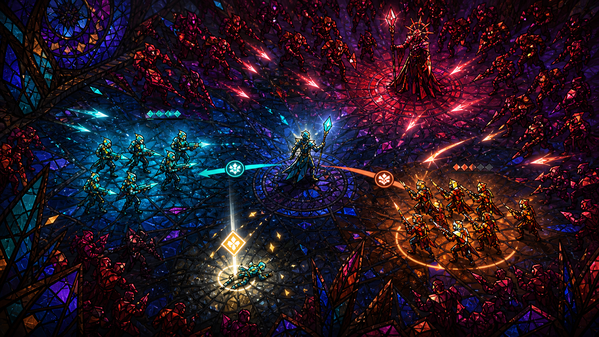

# 아트 D — 스테인드글라스 종말전쟁

## 방향

색유리 속 전쟁이 움직이기 시작한 듯한 판타지 전장이다. 캐릭터와 지형을 어두운 납선으로 나누고 공격은 빛과 유리 균열로 표현한다.

## 시각 언어

- 배경: 코발트·보라색 유리와 검은 납선
- 분대: 청록 유리와 호박·주홍 유리
- 적군: 포도주색과 심홍색 유리
- 공격: 균열, 빛의 파편, 추상적인 장미창형 파동
- 구조: 백금색 유리가 다시 이어지는 연출
- 사기 붕괴: 적을 구성하던 조각이 어두워지며 흩어짐

## 장단점

- 공격, 성장과 보스 장면의 발표 효과가 매우 강하다.
- 유리 파편과 강한 광원이 전투 정보를 가릴 수 있어 효과 밀도 제한이 필요하다.
- 종교 고유 상징을 쓰지 않고 독자적인 기하학 문양을 개발한다.

## 제작 범위

- 유리 지형 타일과 납선 경계 1세트
- 캐릭터별 색유리 실루엣
- 균열·파편·발광 효과와 저비용 셰이더

제작 난이도: 높음 · 독창성: 높음 · 가독성: 중간

