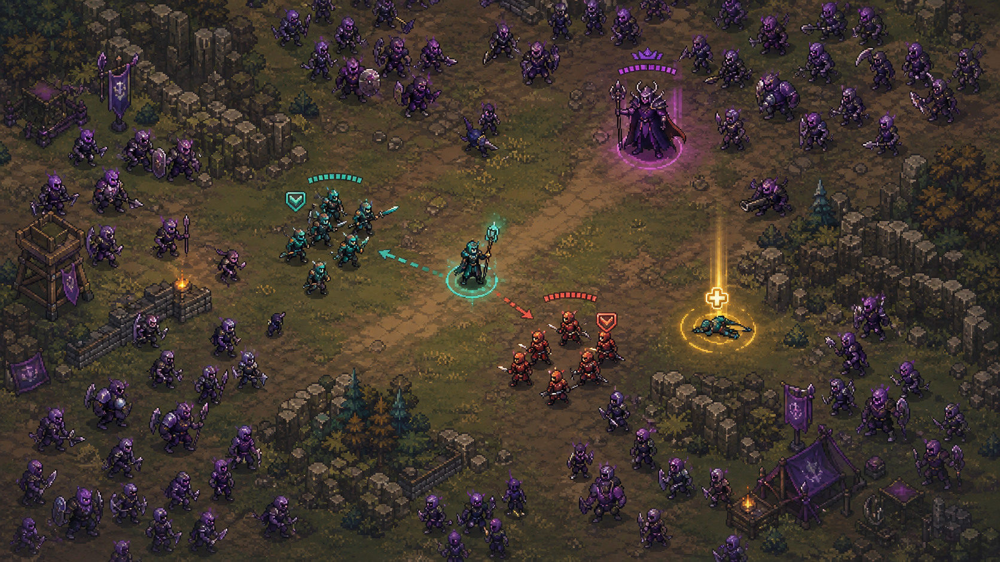

# 아트 E — 32비트 전쟁 군상극

## 방향

1990년대 전쟁 시뮬레이션의 감성을 현대적인 제한 팔레트와 명확한 상태 표시로 재구성한다. 기존 작품의 비율이나 팔레트를 모방하지 않는 독자 픽셀 스타일이다.

## 시각 언어

- 배경: 정교하지만 대비가 낮은 픽셀 타일
- 캐릭터: 작은 몸체와 큰 투구·무기로 병과 식별
- 분대: 청록과 주홍의 외곽선·바닥 링
- 적군: 채도가 낮은 보라색
- 공격: 명확한 3~5프레임 동작과 짧은 섬광
- 구조: 큰 금색 아이콘과 안전한 접근 범위
- 피로: 처진 자세와 둔한 이동 애니메이션

## 장단점

- 성능, 용량과 제작 일정에 가장 안전하며 군상 전투와 잘 맞는다.
- 픽셀 생존 게임이 많아 독창성이 약해질 수 있으므로 실루엣과 팔레트를 강하게 차별화해야 한다.
- 생성 결과는 그대로 쓰기보다 팔레트, 타일 경계와 애니메이션을 수작업으로 정리한다.

## 제작 범위

- 16방향 대신 4방향 캐릭터 애니메이션
- 병과별 이동·공격·피격·쓰러짐·구조 상태
- 지형 타일 1세트와 파티클 스프라이트 12종 내외

제작 난이도: 낮음 · 독창성: 중하 · 가독성: 높음

